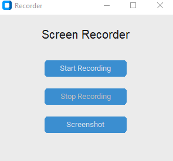

# 🎥 Python Screen Recorder (MSS + CustomTkinter)

<p align="center">
  
</p>

A fast, lightweight desktop screen recording application built entirely in Python. This project upgrades traditional `pyautogui` screen grabbing methods to use the high-performance `mss` library, allowing for smooth video capture alongside a modern, responsive Graphical User Interface (GUI).

## ✨ Features
* **Modern Interface:** Built with `customtkinter` for a sleek, dark-mode ready UI.
* **High-Speed Capture:** Uses `mss` for hardware-level screen grabbing, achieving much higher and stable framerates (30+ FPS) than standard libraries.
* **Responsive Controls:** Implements Python `threading` so the Start/Stop buttons never freeze while the video is recording.
* **Auto-Scaling:** Automatically detects your primary monitor's resolution.
* **Standard Output:** Saves recordings instantly as standard `.mp4` files using OpenCV.

## 🛠️ Tech Stack
* **[CustomTkinter](https://github.com/TomSchimansky/CustomTkinter):** For the GUI framework.
* **[MSS](https://python-mss.readthedocs.io/):** For ultra-fast cross-platform screen captures.
* **[OpenCV (cv2)](https://opencv.org/):** For video encoding and writing.
* **[NumPy](https://numpy.org/):** For fast image array processing.

## 🚀 Installation & Usage

1. **Clone the repository:**
   ```bash
   git clone [https://github.com/YOUR_USERNAME/YOUR_REPO_NAME.git](https://github.com/YOUR_USERNAME/YOUR_REPO_NAME.git)
   cd YOUR_REPO_NAME
